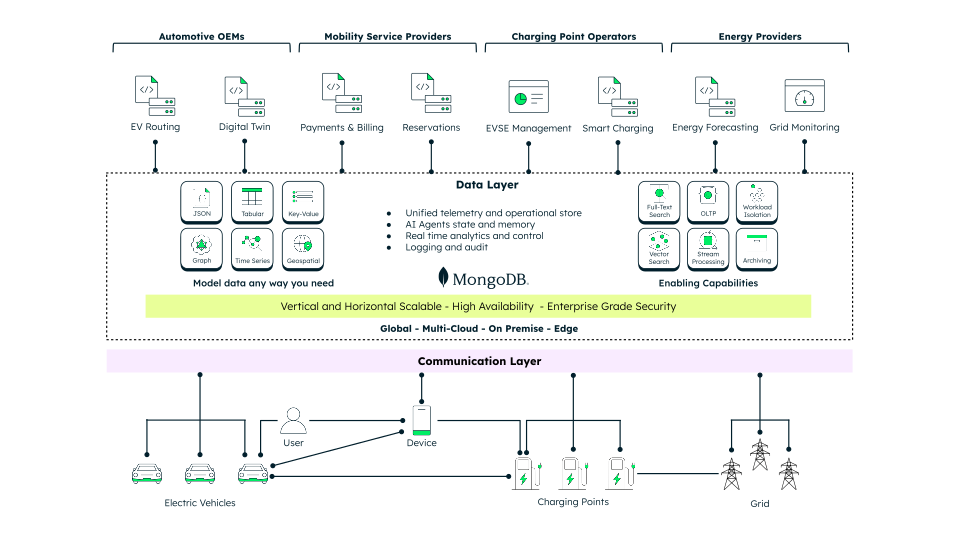
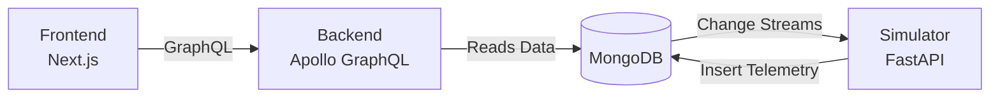

# LeafyCharge EV Charging Demo

LeafyCharge is a compact demo that shows how [MongoDB](https://www.mongodb.com/) can support the operational data layer behind modern EV charging experiences.

It connects station discovery, reservations, charging sessions, telemetry, incidents, and operator analytics in one easy-to-follow application.

This demo builds on earlier COVESA S2DM/VDM work, including the related [conceptual model repository](https://github.com/COVESA/s2dm-example-charging-session-model).

## What The Demo Shows

LeafyCharge has three views over the same charging network:

- **Driver experience**: find nearby stations, filter by connector, price, power, and availability, reserve a charging point, run a session, and report an incident.
- **Operator experience**: monitor availability, utilization, session activity, telemetry load, revenue signals, and customer-impacting incidents.
- **Data modeller view**: explain how domain models, API contracts, and MongoDB document structures relate to each other.

Throughout the app, MongoDB spotlight callouts show the database behavior behind the UI: geospatial queries, faceted aggregation, atomic reservation updates, rich session documents, change streams, time-series telemetry, and real-time analytics.

## Why MongoDB For EV Charging

EV charging data is naturally varied and fast-moving. Stations, EVSEs, connectors, tariffs, reservations, users, vehicles, charger status, diagnostics, telemetry, payments, roaming metadata, and incidents all evolve at different speeds. MongoDB is a good fit because it lets teams model this variety around real application access patterns while still applying validation, indexing, governance, and retention where needed.

In this demo, MongoDB is used as one operational data layer for:

- **Geospatial discovery** with GeoJSON station locations and `2dsphere` indexes.
- **Real-time availability** with atomic updates when a driver reserves a charging point.
- **Session history** using document patterns that keep the booking, pricing, vehicle, station snapshot, charging, cost, and feedback context together.
- **Live telemetry** using change streams and a native time-series collection.
- **Operational analytics** with aggregation pipelines over the same data that serves the application.
- **AI-ready workflows** where operational facts, incidents, telemetry, search indexes, vectors, and agent state can live in a governed platform.



The value is architectural simplicity: fewer synchronization paths, less duplicated data movement, and a clearer foundation for customer apps, operator tools, reporting, automation, and AI-assisted operations.

## Architecture

1. **Frontend**: a Next.js app with driver, operator, and data-modeller views.
2. **Backend**: a Node.js + Express GraphQL API.
3. **Simulator**: a Python + FastAPI worker that reacts to charging session changes and writes telemetry.
4. **Database**: MongoDB, either local through Docker or a MongoDB Atlas deployment.



## Getting Started

### Prerequisites

- Docker Desktop or Docker Engine with `docker compose`.
- Node.js v24+ and npm, if running the web apps locally.
- Python 3.12+, if running the simulator locally.
- Optional: a [MongoDB Atlas](https://www.mongodb.com/products/platform) cluster if you want to use a managed cloud database instead of the local MongoDB container.

### 1. Set Up Environment Variables

```bash
cp .env.example .env
```

For the local Docker path, the `Makefile` provides the MongoDB connection string automatically. For Atlas, set `MONGODB_URI` in `.env` to your Atlas connection string.

### 2. Run With Docker

```bash
make build
```

Use these commands after the first build:

- `make start` starts the local stack again.
- `make stop` stops services without deleting data.
- `make clean` removes services.
- `make cleandb` removes services and deletes local MongoDB data.

To run the app against Atlas instead of the local MongoDB container:

```bash
make build-atlas
```

Then use `make start-atlas`, `make stop-atlas`, and `make clean-atlas` as needed.

### 3. Run Locally Without Docker

Make sure `MONGODB_URI` in `.env` points to a running MongoDB deployment.

> The backend seeds an empty database automatically on first run, so local development needs `mongorestore` from the [MongoDB Database Tools](https://www.mongodb.com/docs/database-tools/installation/installation/) on `PATH`. Docker images already include it.

Start the frontend and backend:

```bash
npm install
npm run dev
```

In another terminal, start the simulator:

```bash
cd simulator
python -m venv .venv
source .venv/bin/activate
pip install -r requirements.txt
python run.py
```

### 4. Open The Demo

- Frontend UI: [http://localhost:3000](http://localhost:3000)
- Backend GraphQL API: [http://localhost:4000/graphql](http://localhost:4000/graphql)
- Simulator health check: [http://localhost:8000/health](http://localhost:8000/health)

## Suggested Demo Flow

1. Start on the home page and explain the driver and operator perspectives.
2. Open Station Finder and use map filters for connector type, power, price, fast charging, and availability.
3. Open a station and reserve a charging point.
4. Go to Session Activity, start a session, and complete it.
5. Report an incident from the session.
6. Switch to Admin View and open the Analytics Dashboard.
7. Use the curly-brace MongoDB spotlights to show the real queries, document shapes, and pipelines behind the experience.

The goal is not to present every screen. The goal is to show how a single operational data platform can support the driver journey, live operations, analytics, and future automation.

## Tech Stack

- Node.js v24+ and TypeScript
- Next.js App Router, Apollo Client, GraphQL Code Generator
- Express, Apollo Server, GraphQL Code Generator
- Python 3.12+, FastAPI, Uvicorn, Pydantic, PyMongo
- Docker and Docker Compose
- MongoDB

## Folder Structure

```text
/
├── backend/            # Node.js GraphQL API (schema-first)
├── frontend/           # Next.js client
├── simulator/          # Python telemetry simulator
├── docs/               # Project documentation
├── docker-compose.yml  # Orchestration
├── Makefile            # Convenience commands
└── .env.example        # Template for environment variables
```

## Notes

- **Schema-first GraphQL**: SDL files live under `backend/schema/governed` and `backend/schema/app`. If you modify them, run `npm run codegen` to update generated types.
- **MongoDB Compass**: the local container starts as a single-node replica set (`rs0`). To connect with Compass, use:
  `mongodb://localhost:27017/?replicaSet=rs0&directConnection=true`

## License

This project is licensed under the terms of the [LICENSE](LICENSE) file.
